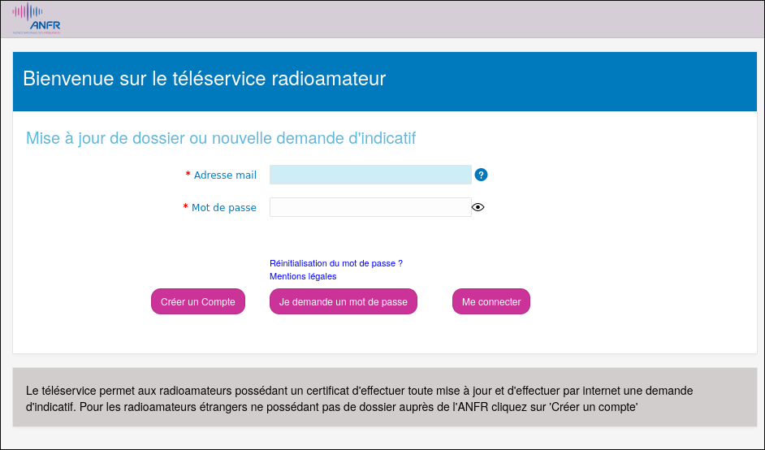
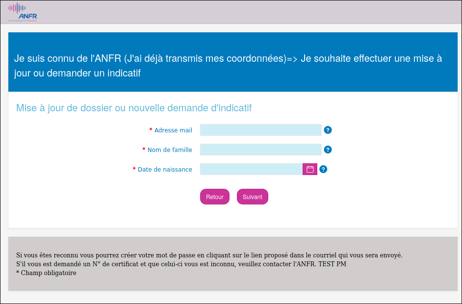
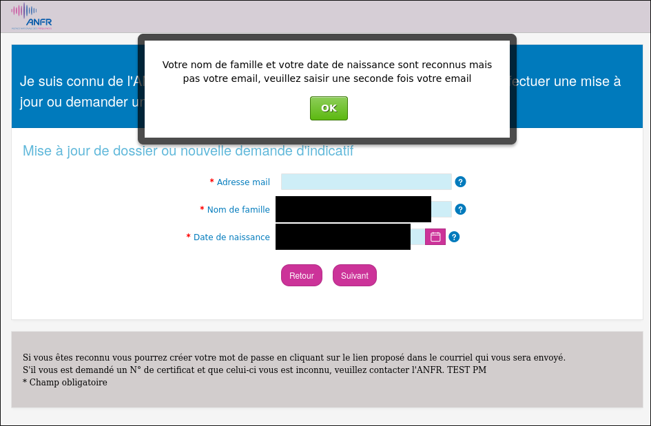
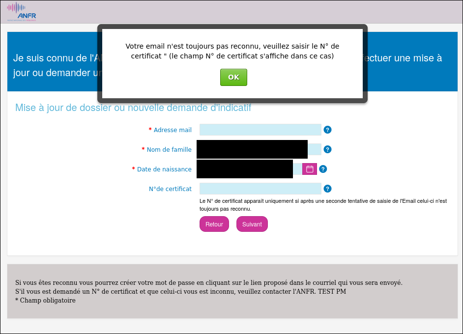
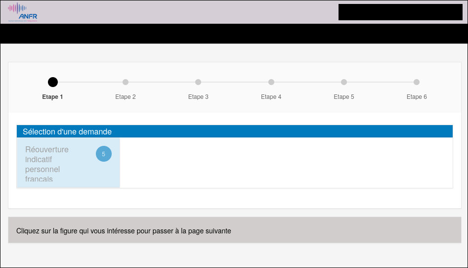

# Première connexion au téléservice ANFR — déclaration de réussite à l'examen radioamateur

Ce guide pas à pas s'adresse aux personnes venant de réussir l'examen radioamateur (HAREC) et qui souhaitent activer leur compte sur le téléservice de l'ANFR pour obtenir leur indicatif.

## Avant de commencer

Prépare :

- L'**adresse mail** utilisée lors de l'inscription à l'examen.
- Ton **nom de famille** tel qu'enregistré le jour de l'examen.
- Une **copie numérique de ta pièce d'identité** (CNI ou passeport), recto + verso **dans un seul fichier**.
- Une **copie numérique de ton attestation de réussite** reçue par courrier.

> ⚠️ **Aucun fichier ne doit dépasser 1 Mo.** Compresse tes scans/PDF avant l'upload.

## Étape 1 — Ouvrir le téléservice

Va sur : <https://teleservice-amateurs.anfr.fr/ords/f?p=300:9999>

La page de connexion affiche deux champs (*Adresse mail* / *Mot de passe*) et trois boutons :

- **Créer un compte**
- **Je demande un mot de passe**
- **Me connecter**

## Étape 2 — Demander un mot de passe

Ton dossier existe déjà côté ANFR (créé automatiquement à partir du PV d'examen), mais aucun mot de passe n'y est associé.

1. Clique sur **« Je demande un mot de passe »**.
2. Renseigne :
   - **Adresse mail** : celle utilisée à l'inscription à l'examen.
   - **Nom de famille** : à l'identique de l'état civil transmis au centre d'examen.
3. Clique sur **Suivant**.

Message attendu : *« Si vous êtes reconnu, vous pourrez réinitialiser votre mot de passe en cliquant sur le lien proposé dans le courriel qui vous sera envoyé. »*

### En cas de difficulté

- **Erreur « Could not parse JSON » ou site inutilisable** : vide entièrement le *local storage* de ton navigateur, puis recharge la page.
- **Message « adresse mail incorrecte »** : valide et réessaie — l'erreur peut être transitoire.

  

- **Après trois tentatives infructueuses**, le site propose de saisir l'**identifiant de ton certificat de réussite** (présent sur l'attestation reçue par courrier). Cette voie de secours déclenche l'envoi du courriel d'activation.

  

## Étape 3 — Activer le compte via le mail reçu

1. Ouvre ta boîte mail (vérifie aussi les indésirables).
2. Clique sur le lien d'activation contenu dans le courriel ANFR.
3. Définis ton mot de passe.

> ⚠️ **Contraintes du mot de passe** : 8 à 12 caractères, contenant au moins une majuscule, une minuscule et un chiffre.

4. Valide.

## Étape 4 — Se connecter

Retourne sur <https://teleservice-amateurs.anfr.fr/ords/f?p=300:9999> et saisis :

- **Adresse mail** : celle utilisée pour la demande.
- **Mot de passe** : celui que tu viens de définir.

Clique sur **Me connecter**.

## Étape 5 — Réouverture de l'indicatif personnel

Une fois connecté, une seule action est disponible : **« Réouverture indicatif personnel français »**.

### C'est ici que tu découvres ton indicatif !

**Dès que tu cliques sur « Réouverture indicatif personnel français », ton indicatif s'affiche dans les champs du formulaire !**

### Compléter le formulaire

Bonne nouvelle : **tout l'état civil est déjà prérempli** par l'ANFR (nom, prénom, date et lieu de naissance, etc.). Tu n'as rien à ressaisir, juste à vérifier.

Il te reste à :

- Vérifier / compléter l'**adresse postale** — les **coordonnées géographiques se remplissent automatiquement** à partir de l'adresse.
- Téléverser les pièces jointes demandées (pièce d'identité, attestation de réussite ; rappel : 1 Mo max par fichier).

### Puissances autorisées (rappel HAREC)

| Bande | Puissance max |
|---|---|
| HF | 500 W |
| VHF | 120 W |
| UHF | 100 W |
| SHF | 10 W |

Vérifie le récapitulatif, puis valide la demande.

## Étape 6 — Confirmation

Une fois la demande validée, tu reçois un **mail de confirmation** de l'ANFR.
